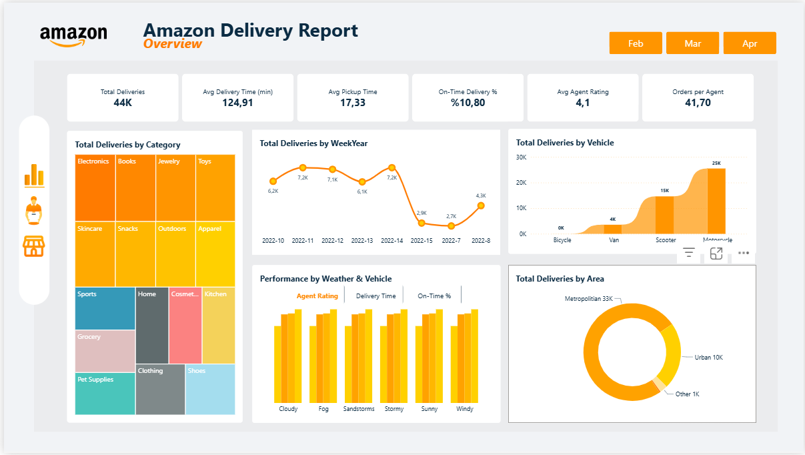
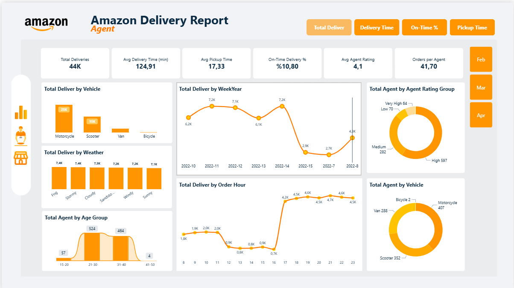
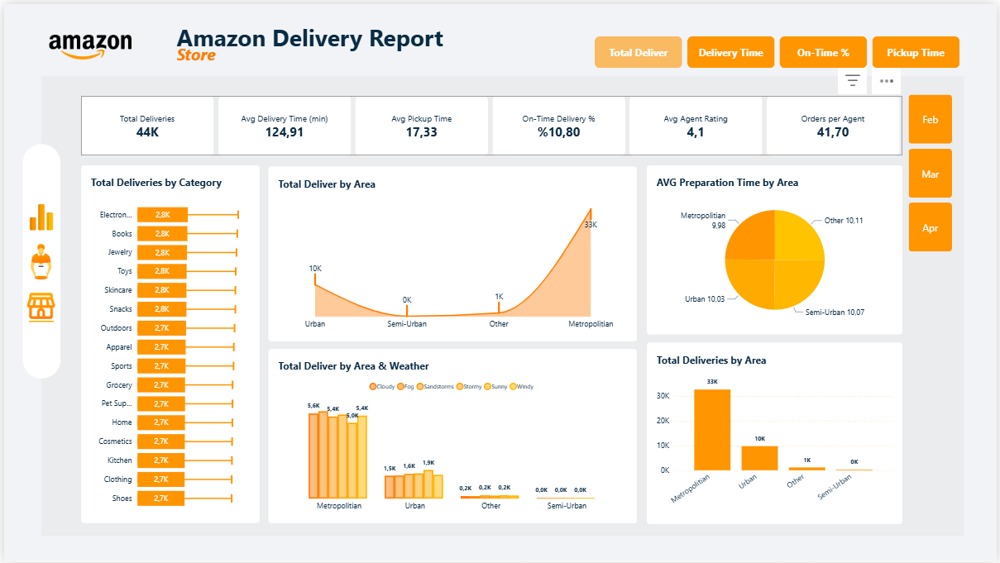

# 🚚 Amazon Delivery Performance Dashboard (Power BI) 

Bu proje, Kaggle’dan alınan Amazon teslimat verilerini kullanarak oluşturduğum etkileşimli bir Power BI satış performansı dashboard’ıdır. Rapor; teslimat süreleri, ajan performansı, bölge bazlı dağılım, kategori analizi, hava durumu etkisi ve daha birçok metriğin detaylı görselleştirmelerini içerir.

  

 📊 Data Source: <a href="https://www.kaggle.com/datasets/sujalsuthar/amazon-delivery-dataset" target="_blank">Kaggle - Amazon Delivery Dataset</a>

### 🗄️ Veri Kaynağı ve SQL Süreci

Kullanılan büyük hacimli veri, Power BI’e geçmeden önce SQL Server üzerinde düzenlenmiş, temizlenmiş ve analize hazır hale getirilmiştir.
Yapılan SQL işlemleri:

* Tarih – saat kolonlarının dönüştürülmesi

* Dim–Fact yapısının oluşturulması

* Kategoriler, bölgeler, hava durumu, araç tipi gibi tüm boyut tablolarının ilişkilere uygun formatlanması

Model Power BI’e taşındığında, ilişkiler doğrudan star-schema yapısına uygun şekilde kurulmuştur.

### 📊 Power BI Modeli

Model aşağıdaki ana tablolardan oluşur:

FactDelivery – Teslimat kayıtları

DimDate – Tarih boyutu

DimCategory – Ürün kategorileri

DimAgent – Teslimat personeli bilgileri

DimArea – Bölge sınıfları

DimWeather – Hava durumu koşulları

DimVehicle – Araç türleri

### 🧮 DAX Hesaplamaları

Rapor genelinde kullanılan başlıca hesaplamalar:

✦ Toplam teslimatlar

✦ Ortalama teslimat süresi (min)

✦ Ortalama hazırlık süresi

✦ On-time teslimat oranı

✦ Kurye başına sipariş

✦ Bölge, kategori, hava durumu ve araç türüne göre satış / teslimat hesaplamaları

✦ WeekYear bazlı dönemsel trend ölçümleri

Ek olarak, raporda çeşitli senaryolarda farklı metrikleri tek görsel üzerinden analiz edebilmek için ✦ ***dinamik measure*** yapısı (field parameter) kullanılmıştır.

### ✨ Dashboard Pages

Dashboard üç sayfadan oluşuyor:

**1️⃣ Overview**

 Genel operasyon görünümü:

🔸 Toplam sipariş, satış, teslimat süresi

🔸 Trend grafikler

🔸 Kategori bazlı hızlı özetler

  

2️⃣ Agent

 Kurye performansı:

🔸 Sipariş adetleri

🔸 Ortalama teslimat süreleri

🔸 Gün içi dağılım

  

3️⃣ Store

Mağaza bazlı analiz:

🔸 Hazırlama süresi karşılaştırmaları

🔸 Kategori kırılımında satış

🔸 Bölgesel performans özetleri (coğrafi konum verisi sahte olduğundan harita tercih edilmedi)

  

